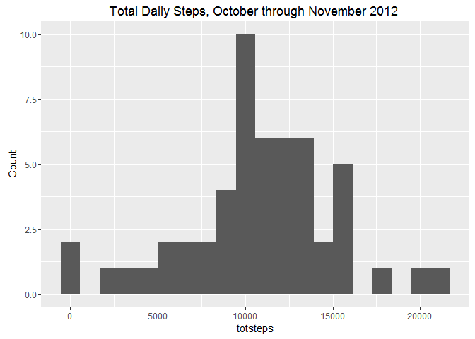
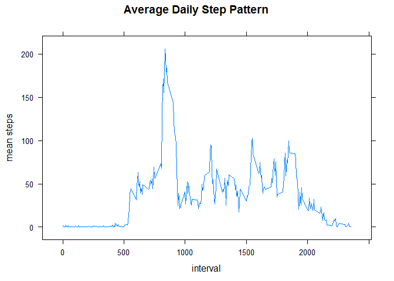
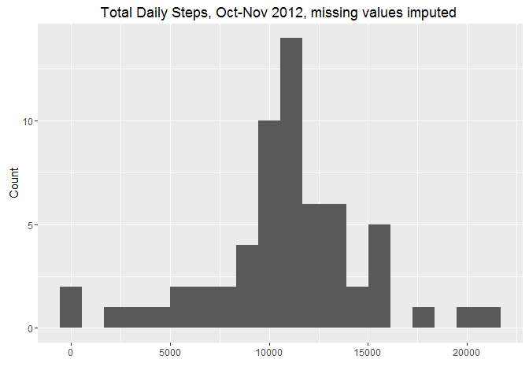
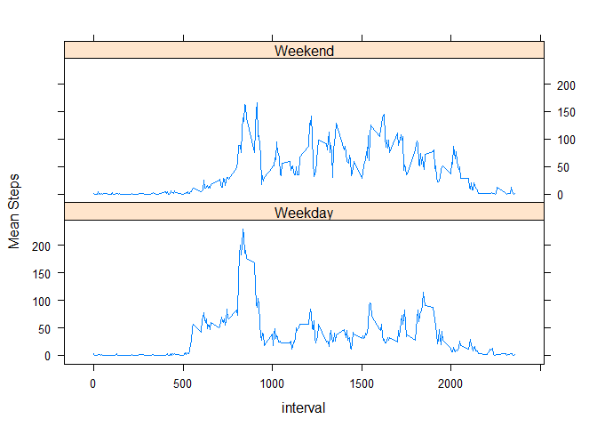

Report on Activity Observations
===============================

Loading and preprocessing the data
----------------------------------

    library(dplyr)
    library(ggplot2)
    library(lattice)
    setwd("I:/rprog-Course5-Week2")

    tab1 <- read.csv(file="activity.csv",sep=",",stringsAsFactors = FALSE) %>% mutate(obsDate=as.Date(date,format="%m/%d/%Y"))

What is mean total number of steps taken per day?
-------------------------------------------------

Create Histogram of mean steps per day when missing values are excluded.

    by_date <- tab1 %>% group_by(obsDate) %>% summarize(totsteps=sum(steps))
    g <- ggplot(by_date, aes(totsteps))
    maintitle <- "Total Daily Steps, October through November 2012 "
    mn_steps1 <- mean(by_date$totsteps,na.rm=TRUE)
    md_steps1 <- median(by_date$totsteps,na.rm=TRUE)
    g+ geom_histogram(bins=20) +ylab("Count") + ggtitle(maintitle)

    ## Warning: Removed 8 rows containing non-finite values (stat_bin).

    ## [1] "mean steps =  10766.1886792453"

    ## [1] "median steps =  10765"

What is the average daily activity pattern?
-------------------------------------------

Create Time Series Plot of average daily activity pattern

    by_intvl <- tab1 %>% group_by(interval) %>% summarize(int_mn=mean(steps,na.rm=TRUE))
    with(by_intvl,xyplot(int_mn~interval,type="l",ylab="mean steps",main="Average Daily Step Pattern"))

    row_of_max <- with(by_intvl,which.max(int_mn))
    max_int <- by_intvl[row_of_max,"interval"]
    step_max <- round(by_intvl[row_of_max,"int_mn"],2)

    ## [1] "Maximum average daily steps is  206.17 and occurs at interval  835"

impute missing values and make new histogram
--------------------------------------------

To impute missing values, the average of non-missing values was computed
at each interval. Then the appropriate mean value was substituted for
each missing value.

    ## [1] "Count of missing step values =  2304"

    int_mn <- filter(tab1,steps>=0) %>% group_by(interval) %>% summarize(replc=mean(steps,na.rm=TRUE))

    tab2 <- merge(tab1,int_mn)
    tab3 <- tab2 %>% mutate(steps1=ifelse(is.na(steps),replc,steps))
     bydate <- tab3 %>% group_by(obsDate) %>% summarize(totsteps=sum(steps1))
    k <- ggplot(bydate, aes(totsteps))
    maintitle <- "Total Daily Steps, Oct-Nov 2012, missing values imputed "
     mdsteps <- round(median(bydate$totsteps,na.rm=TRUE),2)
     mnsteps <- round(mean(bydate$totsteps,na.rm=TRUE),2)
    k + geom_histogram(bins=20)+ xlab(" ") +ylab("Count") + ggtitle(maintitle)

WIth the imputed values, the mean is equal to the median.

    ## [1] "Median steps after substituting imputed values for NAs =  10766.19"

    ## [1] "Mean steps after substituting imputed values for NAs =  10766.19"

Are there differences in activity patterns between weekdays and weekends?
-------------------------------------------------------------------------

Two panel plot, weekend vs weekday

    tab4 <- tab3 %>% mutate(wkdayind=ifelse(weekdays(obsDate) %in% c("Sunday", "Saturday"),"Weekend","Weekday"))
    by_intvl2 <- tab4 %>% group_by(interval,wkdayind) %>% summarize(stepsMn=mean(steps1))
    ylabel <-"Mean Steps"
    with(by_intvl2,xyplot(stepsMn~interval|wkdayind,type="l",ylab=ylabel,layout=(c(1,2))))

The pattern of activity across intervals appears to differ depending on
whether the days are week days or weekend days. Week day activity
appears to be higher in the 500 to 900 interval number range relative to
weekends, and lower in the 1000 to 1800 interval range.
